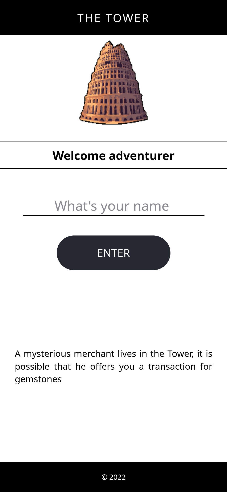
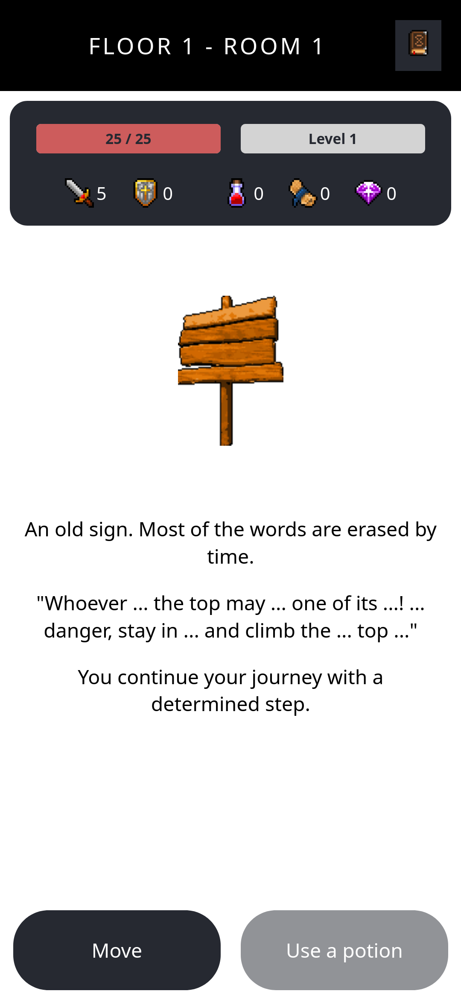
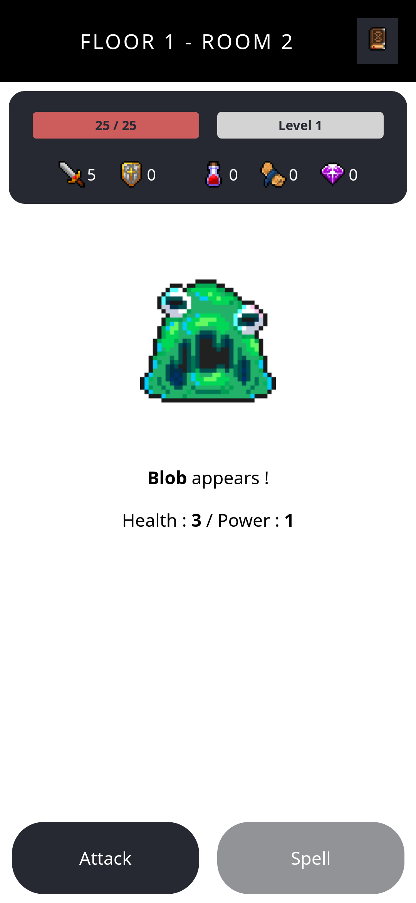
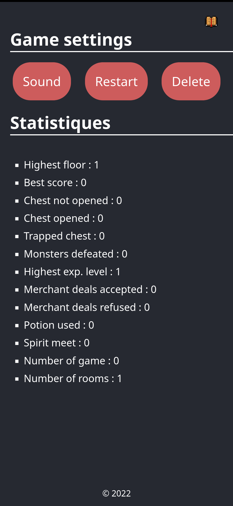

# Tower

An infinite and simple RPG designed for mobile and playable in your browser.

# Ressources

All the sprites and icons comes from two itch.io pack :
- [Kyrise's Free 16x16 RPG Icon Pack](https://kyrise.itch.io/kyrises-free-16x16-rpg-icon-pack)
- [RPG minions & boss pack](https://beowulf.itch.io/rpg-boss-monsters-minions-huge-pack)